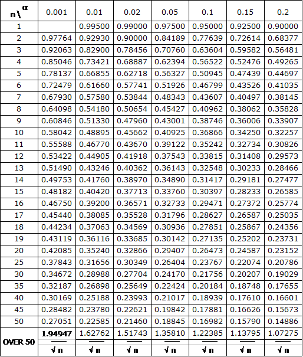
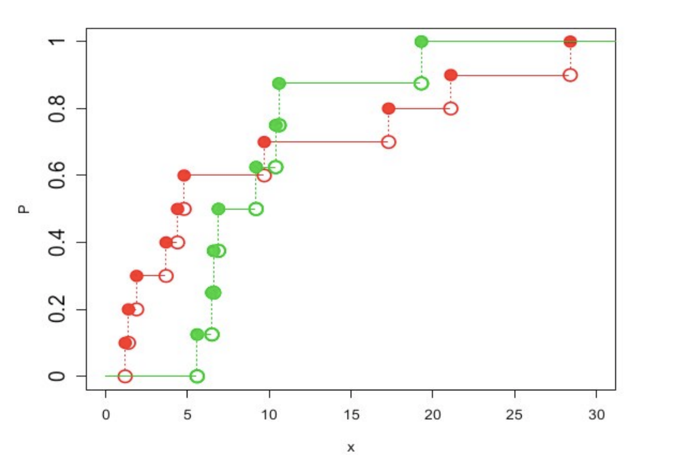

# The Kolmogorov-Smirnov Test

## Introduction

During data analysis, You have to satisfy a number of assumptions for the underlying dataset as we have seen before. One of the most common assumptions that you will come across with is the "Normality Assumption" i.e. the underlying data belongs to a normal distribution. 

If a certain distribution is not found to be normally distributed (i.e. data with kurtosis and skew while doing linear regression), you may first answer a question like:  “Given my data … if there is a deviation from normality, will there be a material impact my results?”

In this lesson we'll look at a popular statistical test for satisfying the normality assumption, The Kolmogorov-Smirnov Test, or simply, the KS-test. 

## Objectives

You will be able to:

* Explain Normality Assumption and role of statistical tests
* Describe and calculate a one sample Kolmogorov-Smirnov test
* Describe and explain a two sample Kolmogorov-Smirnov test

## Normality Assumption

It is a known fact that formal normality tests always reject on the huge sample sizes we work with today. When n (our sample size) gets large, even the smallest deviation from perfect normality will lead to a significant result. And as every dataset has some degree of random noise, no single dataset will be a **perfectly** normally distributed sample. 

>**In applied statistics the question is not whether the data/residuals are perfectly normal, but normal enough for the assumptions to hold**.

This question is answered through visualization techniques we've seen before like qqplots, Boxplots, of more advanced statistical tests including:

- The Shapiro-Wilk test;
- The Anderson-Darling test, and;
- The Kolmogorov-Smirnov test.

In this lesson, we'll focus on the KS-test which will give you a strong foundation to help you understand and implement other tests when needed. 

## The Kolmogorov-Smirnov Test

A KS test provides a way of comparing distributions, whether two sample distributions or a sample distribution with a theoretical distribution - comparable to what we've already seen when we learned about one sample or two sample t-tests. The distributions are compared in their cumulative form as **Empirical Cumulative Distribution Functions**. The test statistic in KS test used to compare distributions is simply the maximum vertical distance between the two functions. Essentially, we are testing the sample data against another sample, to compare their distributions for similarities.

### The Empirical Cumulative Distribution Function (ECDF)

> An empirical cumulative distribution function (CDF) is a non-parametric estimator of the underlying CDF of a random variable. It assigns a probability to each data point, orders the data from smallest to largest in value, and calculates the sum of the assigned probabilities up to and including each data point.

The most intuitive way to think about the empirical distribution function is that it relates to the CDF in a similar way to how a histogram relates to a probability density function. Let's look at following figures to get this idea:


The left figure shows a regular histogram with samples looking like a normal distribution. The right figure shows the same samples except each bin in the histogram contains the cumulative count of samples up to that bin, which approximates the shape of the CDF for this random variable. Now the right figure doesn't exactly represent an empirical distribution function because the Y-axis is not normalized to  1  and the samples are binned instead of just plotted cumulatively. Nonetheless, the idea remains the same. An example of an empirical CDF is given below:


This image sums up the intuition for empirical distribution function. The blue line is our empirical CDF whereas the  grey one is our theoretical CDF (i.e. plotted using parameters and fitting a probability function).

If X is a random variable with CDF $F(x)=P(X≤x)$ , and  $x1,…,xn$ are i.i.d. random variables sampled from  
X . Then, the empirical distribution function,  $F̂(x)$ , is a CDF:

$$\hat{F}(x) = \frac{\text{# of elements in sample} \leq x}{n} = \frac{1}{n} \Sigma_{i=1}^n I(x_i \leq x) \tag{1}$$

### One-Sample KS test

This is also known as the **Kolmogorov-Smirnov Goodness of Fit Test**. It calculates the similarity between an observed (empirical) distribution and a completely specified theoretical continuous distribution. It is sensitive to all attributes of a distribution including mean, variance and shape.

The key assumptions of the one sample test are that the theoretical distribution is fully defined continuous distribution, in terms of its parameters. This obviously means that its most common use case is that of testing normality. The test statistic, $d$,  is simply the largest deviation between the observed cumulative function and the expected theoretical cumulative frequency distribution, i.e. 

$$
d	   =    	max(abs[F_0(X)-F_r(X)])
$$

where
- **d** is the maximum deviation Kolmogorov statistic 
- **F<sub>0</sub>(X)** = (No.of observations ≤ X)/(Total no.of observations) i.e. the non parametric empirical distribution
- **F<sub>r</sub>(X)** = The theoretical frequency distribution of X - parametric (e.g. based on mean value) 


**Null Hypothesis:** There is no difference between the distribution of our sample and a normal distribution. 

**Acceptance Criteria:** If calculated value is less than critical value, accept the null hypothesis.

**Rejection Criteria:** If calculated value is greater than table value, reject the null hypothesis.

### Example
#### Problem Statement:

In a study done from various modules of a data science course with 60 students, equal number of students are samples from each module. These students are interviewed and their intention to join the advanced machine learning module was noted. Following shows how many students showed a positive intention

- Python (5) 
- Data Visualizations (9)
- SQL (11)
- Statistics (16)
- NLP (19)

It was expected that 12 students from each module would join advanced ML. 

Let's use K-S test to find if there is any difference among student classes with regard to their intention of joining the Drama Club.

First we need to set up our null hypothesis. 

> Ho: There is no difference among students of different modules with respect to their intention of joining advanced ML. 


```
Streams	   No. of students interested in joining	FO(X)	Fr(X)	|FO(X)−FT(X)|
           Observed(O)	Theoretical(T)	 	 	 
Python	   5	        12	                        5/60	12/60	7/60
Viz.	   9	        12	                        14/60	24/60	10/60
SQL 	   11	        12	                        25/60	36/60	11/60
Stats	   16	        12	                        41/60	48/60	7/60
NLP 	   19	        12	                        60/40	60/60	60/60

Total	   n=60	 	
```

According to the formula above, 
$$
d	   =    	max(abs[F_0(X)-F_r(X)])
$$

$$ d = 11/60 = 0.183$$

Here's the Smirnov d-statistic for reference: 



The table value of d at 5% significance level is given by
$${d (0.05) = \frac{1.36}{\sqrt{n}}} \\[7pt]
\, = \frac{1.36}{\sqrt{60}} \\[7pt]
\, = 0.175$$


Since the calculated d value (0.183) is greater than the critical value (0.175), hence we reject the null hypothesis and conclude that there is a difference among students of different modules in their intention of joining the advanced ML course. 


### Two-Sample KS Test

The two-sample KS test checks if two **independent** samples have been drawn from the same population, or, equivalently, from two identical populations (X = Y).

As with the one-sample test, it is moderately sensitive to all parameters of the distribution. The one-tailed version of this test has a specific purpose i.e .to test whether values of one population are larger than values of another population. Similar to 1-sample test, cumulative distributions are compared, but here two sample distributions are compared instead of a sample distribution and a theoretical distribution as we saw above. For the two-tailed version of the test, the test statistic (d) is the largest absolute deviation between the two observed cumulative step functions, irrespective of the direction of the difference.

> The null hypothesis states for this test that there is no difference between the two distributions. The d-statistic is calculated in the same manner as we saw above.

$$d	   =    	max[abs[{F_{n1}(X)-F_{n2}(X)}]]$$


- n1 = Observations from first sample.

- n2 = Observations from second sample.

When the cumulative distributions shows large maximum deviation d, it is a reflection of difference between the two sample distributions.

The critical value of d for samples where n1=n2 and is ≤ 40, the K-S table for two sample case is used. When n1 and/or n2 > 40 then the K-S table for large samples of two sample test should be used. The null hypothesis is accepted if the calculated value is less than the table value and vice-versa.

Thus use of any of these nonparametric tests helps a researcher to test the significance of his results when the characteristics of the target population are unknown or no assumptions had been made about them.

### Example

Given two samples, test if their distributions are the same.

Compute the observed cumulative distribution functions of the two samples and compute their maximum difference.
```
X : 1.2, 1.4, 1.9, 3.7, 4.4, 4.8, 9.7, 17.3, 21.1, 28.4
Y : 5.6, 6.5, 6.6, 6.9, 9.2, 10.4, 10.6, 19.3
```

We sort the combined sample, in order to compute the empirical cdfs:

the combined sample, in order to compute the
empirical cdf’s:
```    
   1.2 1.4 1.9 3.7 4.4 4.8 5.6 6.5 6.6 6.9 9.2 9.7 10.4 10.6 17.3 19.3 21.1 28.4
Fx 0.1 0.2 0.3 0.4 0.5 0.6 0.6 0.6 0.6 0.6 0.6 0.7 0.7  0.7  0.8  0.8  0.9  1.0
Fy 0.0 0.0 0.0 0.0 0.0 0.0 0.1 0.2 0.4 0.5 0.6 0.6 0.8  0.9  0.9  1.0  1.0  1.0

```


The Kolmogorov-Smirnov statistic is again the maximum absolute difference of the two observed distribution functions. From above image, and also by feeding above values in the given formula, we get **d = 0.6**.

For two samples, the 95% critical value can be approximated by
the formula:

$$d(0.05) = 1.36\sqrt{1/n_1 + 1/n_2} = 0.645$$

Since 0.6 < 0.645, we retain the null hypothesis in this case. 

---
Kolmogorov-Smirnov tests have the advantages that:
- the distribution of statistic does not depend on cumulative distribution function being tested and  
- the test is exact. 

They have the disadvantage that they are more sensitive to deviations near the centre of the distribution than at the tails.

 

## Summary 

In this lesson we looked at KS test and how this test can be used to test for normality assumptions. We looked at a one sample Ks test and a two sample ks tests with simple examples. Next, we'll see how to implement these tests in python. 
